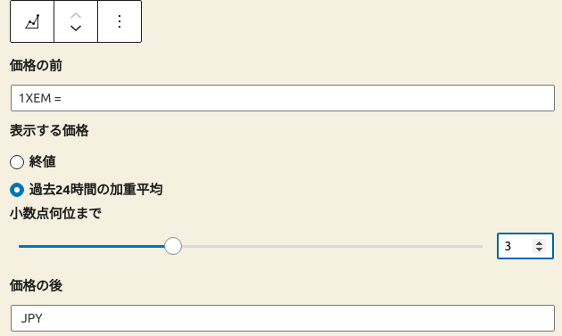

# nem-price
WordPress plugin: nem price display via zaif api

## プラグインの概要
zaif api を利用して、仮想通貨 nem の価格を表示する WordPress プラグイン。

## API URLの設定
/wp-admin/options-general.php?page=crypt で、zaif api の url を入力する。

## ブロックエディタ
WordPress の編集画面でブロックを選択し、編集する

* 価格の前のテキスト
* 表示する価格 - 終値か、24時間の平均か
* 価格は小数点何位まで表示するか
* 価格の後のテキスト

が設定可能

## ライセンス
GPL ver.2.0 or later

## コメント、提案などは
ブロックチェーンユーザーのコミュニティサイト [NEMHub](https://community.nem.io/signup/Wnucqh8gBF) にてお願いします。
